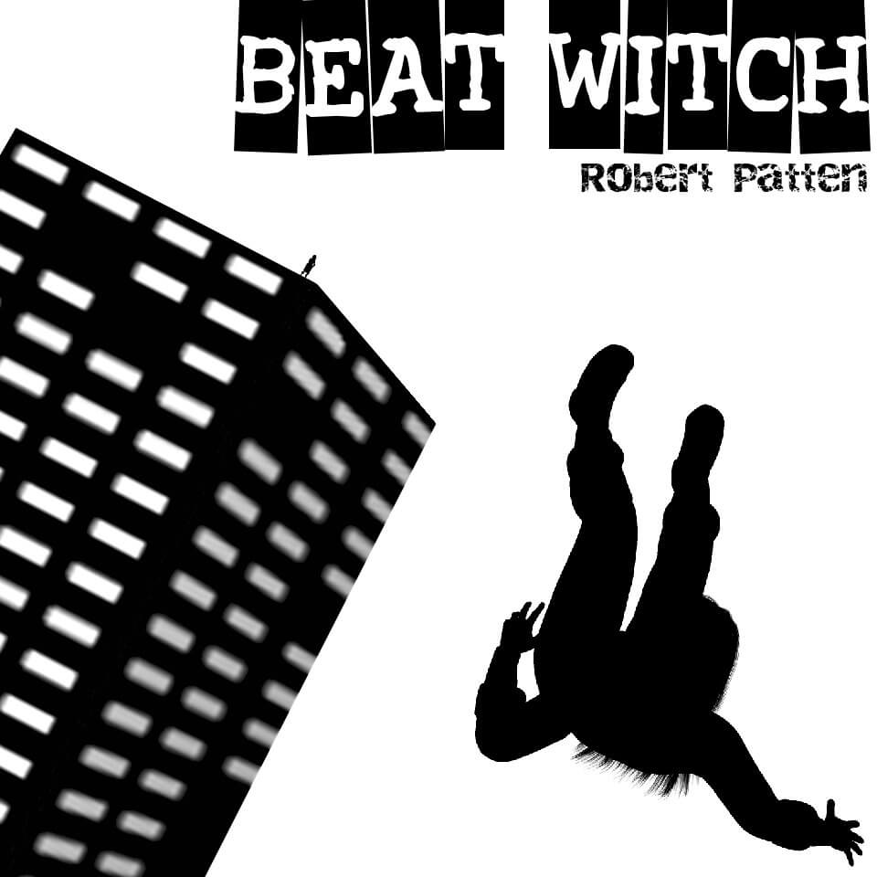

# Beat Witch 
_An Interactive Loneliness By Robert Patten_

This is the source code for Beat Witch, a horror text adventure (interactive fiction) that involves a mysterious plague, music that can kill you, and the undead. 

It is being released primarily to help other Inform authors, though it's not supposed to be a shining example of great code. It's quite hacky in some parts. 

A big issue I ran into was that when I was coding the game was that the online interpreters (Parchment/Quixe) did not support sound. (They may by the time you read this.) I used [Vorple](https://vorple-if.com/) to get around the issue, and other Inform coders may be curious at how I got sound to work in traditional interpreters and the browser at the same time. See Book Music.

However, as of this date, Brian Rushton's [Bisquixe](https://intfiction.org/t/beginners-guide-to-styling-inform-releases-with-bisquixe/66226) is probably the better option for adding sounds for online play. (Reasons: Vorple has scrolling issues, in 2023 wouldn't produce IFComp's player transcripts, and Bisquixe is closer to standard interpreter behavior, as far as I understand.) Bisquixe was not available when I created Beat Witch. I really should move everything over it it, but Vorple is tightly coupled with this code, so it will take some effort to do so.

Players who want to find out more about the beat witch world or the author's deranged thought processes may also find the source code interesting. If you haven't played through Beat Witch at least once, come back after you have done so. 

The main source code file is [Beat Witch.inform/Source/source.ini](https://github.com/pat10/Beat-Witch/blob/main/Beat%20Witch.inform/Source/story.ni). 

You can find the latest version of the game [here](https://ifdb.org/viewgame?id=bkct2lhv4u5z818a).

## Legal stuff

You are free to use selections of this code and adapt them for personal or commercial projects. But I am not releasing the characters, world, story, etc., for public use here -- just the code. 

I have also included music. This is for people intending to experiment and compile the story on their own. You are also welcome to download it for your personal use only. See the credits in the help menu for more information on the music, as well as the sound effects (which I did not produce).

Extensions I used are included as well. While these are all publicly available, please respect the rights of the respective authors.

__--Robert Patten__
__A Basement in Idaho__
__April 1, 2024__